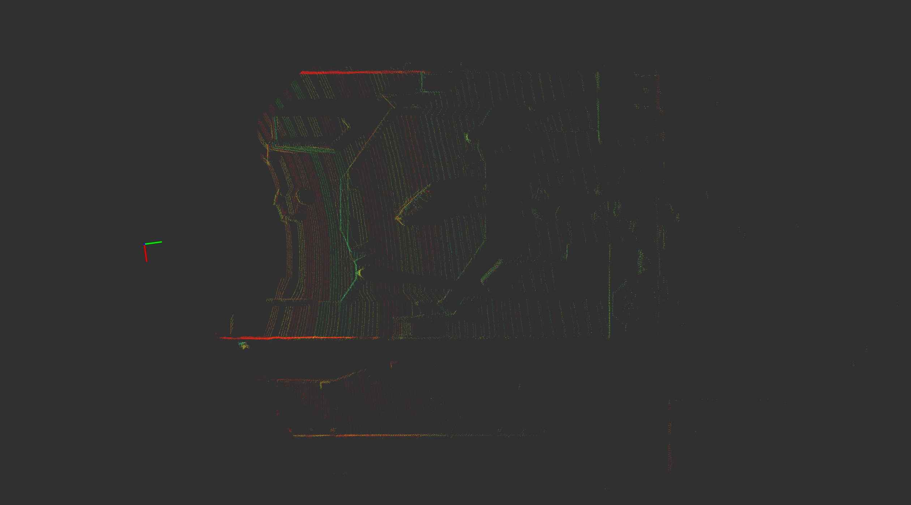
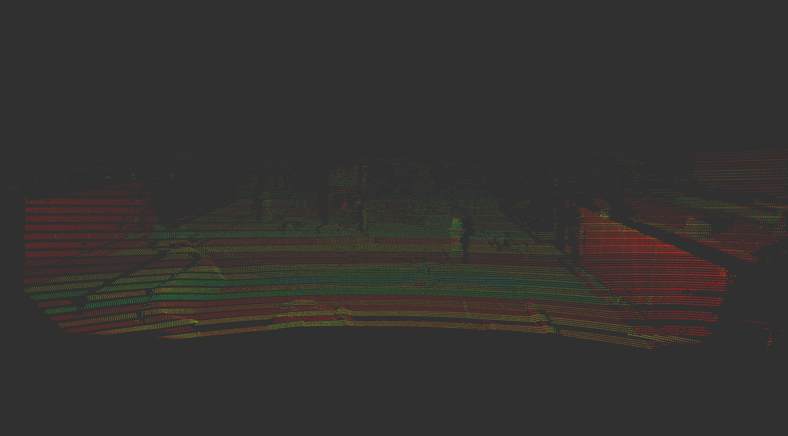

<div align="center">
	
</div>

<h2 align="center">ROBOMASTER-2025 · 华北理工大学HORIZON战队 · LiDAR ROSBAG</h2>


---

## 📖 概述

<div align="left">

**数据来源：** [华北理工大学 HORIZON 战队 — 雷达组](https://github.com/BreCaspian/RoboMaster-Lidar-Lab)  
**依托平台：** [华北理工 RM 创新实验室](https://space.bilibili.com/481866846?spm_id_from=333.337.0.0)  
**录制时间地点：** ROBOMASTER 2025 超级对抗赛，北京理工大学（珠海）南部赛区现场实录  
**数据用途：** ROBOMASTER 场景下的点云识别、目标检测、三维建图等任务  

</div>

---

## 🗂️ 数据概览

| 文件名                      | 时长     | 大小      | 消息数  | 点云话题           |
| ------------------------ | ------ | ------- | ---- | -------------- |
| `RM-LiDAR-ROSBAG_01.bag` | 13分22秒 | 11.2 GB | 8037 | `/cloudpoints` |
| `RM-LiDAR-ROSBAG_02.bag` | 13分59秒 | 12.9 GB | 8399 | `/cloudpoints` |

> 数据格式为标准 ROS 1 `.bag` 文件，未压缩，采样频率设置为 10 Hz。

<div align="center">
  
  <br/>
  
</div>


​	🎥 ROSBAG展示视频：[Bilibili 视频链接](https://www.bilibili.com/video/BV1s6tnz9Enr/?spm_id_from=333.337.search-card.all.click&vd_source=3c76eab145811dc6a99e9691ce7f2384)

---

## 🛠 使用设备：镭神 CH128X1 激光雷达

|  参数项  |                 值                 |
| :------: | :--------------------------------: |
|  通道数  |               128 线               |
| 探测距离 | 最远 200 m（10% 反射率下约 160 m） |
| 测距精度 |               ±3 cm                |
| 点云速率 |          ≈ 760,000 点/秒           |
|   HFOV   |               ≈ 120°               |
|   VFOV   |               ≈ 25°                |
| 角分辨率 |     水平 0.2°，垂直最小 0.125°     |
| 旋转频率 |           设置为--10 Hz            |

> 得益于高通道密度与点云速率，ROSBAG质量较高可用于比赛相关算法研究。

---

## ⚙ 使用方法

### ▶ 播放数据

```bash
roscore
rosbag play RM-LiDAR-ROSBAG_01.bag
rosbag play RM-LiDAR-ROSBAG_02.bag
```

### 🧿 RViz 可视化

```bash
rviz
```

设置 **`Fixed Frame`** 为：

```
CH128X
```

添加显示项：

```
Add -> By Topic -> PointCloud2（即 /cloudpoints）
```

---

## 🧊 使用建议与注意事项

* **高点云速率**：CH128X1 输出点云密度极高，直接加载可能导致OOM
* **推荐预处理**：建议对原始点云进行下采样（如 `VoxelGrid`, `RandomSample` 等），再接入程序中使用
* **非实时回放建议**：可使用低速率播放（如 `rosbag play -r 0.5`）以便逐帧观察

---

## 📥 数据下载

📁 **百度网盘（Baidu Netdisk）**--🔗 [点击下载](https://pan.baidu.com/s/1ICSTLdOVVyqMbhYS6CnErQ?pwd=RMer) — 提取码：`RMer`

🤗 **Hugging Face**--🔗 [ROBOMASTER-2025-LiDAR-ROSBAG](https://huggingface.co/datasets/BreCaspian/ROBOMASTER-2025-LiDAR-ROSBAG)

---

## 🧾 ROSBAG 话题信息（`rosbag info` 输出）

<details>
<summary><strong>RM-LiDAR-ROSBAG_01.bag</strong></summary>

```
path:        RM-LiDAR-ROSBAG_01.bag
version:     2.0
duration:    13:22s (802s)
start:       May 14 2025 14:31:07
end:         May 14 2025 14:44:30
size:        11.2 GB
messages:    8037
compression: none
topics:      /cloudpoints   [sensor_msgs/PointCloud2]   8037 msgs
```

</details>

<details>
<summary><strong>RM-LiDAR-ROSBAG_02.bag</strong></summary>

```
path:        RM-LiDAR-ROSBAG_02.bag
version:     2.0
duration:    13:59s (839s)
start:       May 15 2025 13:31:01
end:         May 15 2025 13:45:00
size:        12.9 GB
messages:    8399
compression: none
topics:      /cloudpoints   [sensor_msgs/PointCloud2]   8399 msgs
```

</details>

---

## 📄 许可证 / License

本项目采用 MIT 许可证 - 查看 [LICENSE](LICENSE) 文件了解详情。

## 📮 联系方式

如需合作、交流或反馈问题，欢迎联系：

📧 `yaoyuzhuo6@gmail.com`

**Tips :** 十分遗憾的是，该点云数据集所对应的 RGB 视频在录制中由于设备负载较大被异常终止导致视频损坏，当时没能及时发现该问题，后续整理相关数据才发现视频损坏。尽管后续进行了一系列人为视频修复工作，但是效果仍然不佳，大量片段损坏、丢失或马赛克现象严重，**故不对外开源**。

<br/>

<p align="right">
  —— 2025 年 8 月 7 日 · 立秋
</p>
